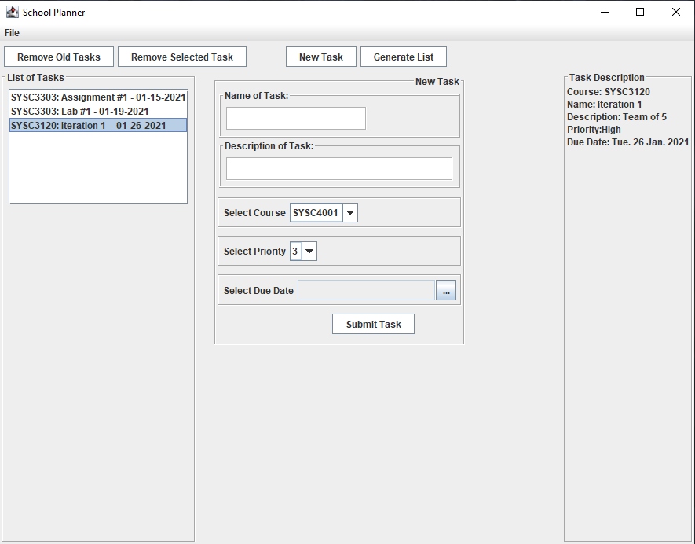

# SchoolPlanner
This application is designed to help manage course assignments, tests, labs and homework tailored for a students specific semester.

## How to Run SchoolPlanner
Navigate the executable jar file and download and open to run the application. 

## About SchoolPlanner
This project was intended to build something to help manage my tasks and produce a list of all school assignments I may have during a school semester. One can add tasks in the program where then a list of these tasks are generated into a .txt file. As well, these lists can be saved to a file in XML format where then it can be easily read and loaded back into the program if one wants to add / edit the tasks of the lists. 

Note: Currently courses in the course selection combobox are hardcoded within the plannerModel.java class for convenience

Figure 1: SchoolPlanner GUI example 

## Future Implementation Ideas
- Have the program automatically clear old tasks using ScheduledExecutorService API
- Instead of exporting/ importing to a txt file, It could be saved to calendar / website to be accessible on mobile
